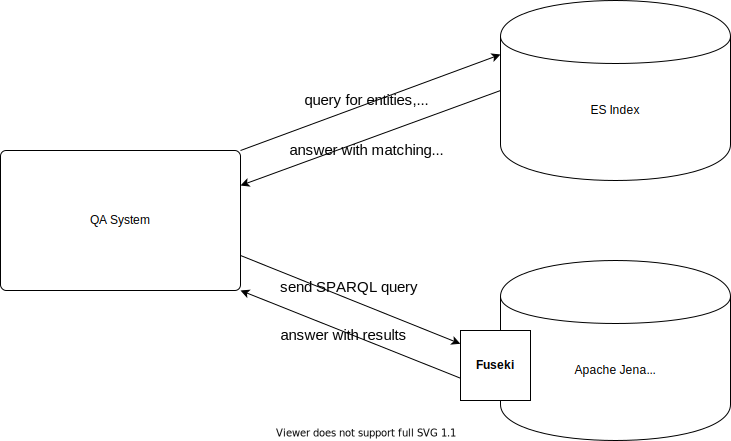
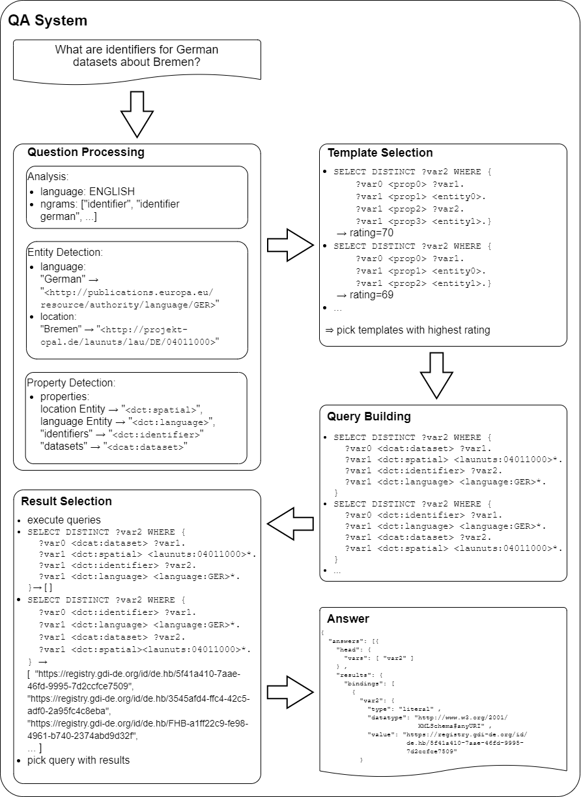

# DCAT QA System

 This project implements Question and Answering system for the DCAT vocabulary developed as part of the bachelorthesis "A Question Answering (QA) System for the Data Catalog Vocabulary (DCAT)".

In particular the project consists of a Spring Boot application that:
  - implements a question and answering system for the dcat vocabulary
  - provides a rest endpoint for sending questions
  - connects to a Triplestore endpoint to execute SPARQL queries and thereby fetch results for a question from the OPAL database
  - connects to a Elasticsearch index for the recognition of named entities and properties in quesion sentences

The following shows an overview of all components of the system and how they communicate:

The QA system employs a multistep pipeline to answer questions. An example of the process can be seen in the following overview:

More info on the implementation details can be found in the [thesis](https://git.cs.uni-paderborn.de/martenls/bachelor-thesis/-/blob/dev/thesis/thesis.pdf).

# API

see [API Documentation](docs/api.md)

# Build

Prerequisites:
  - maven
  - jdk 11

Run

    mvn clean package -DskipTests

to build jar

## Build Docker

The docker container can only be built if before the application was build with maven.

Run

    docker build -t qa-system .

to build a docker image

# Environment Variables

In general, all values from the `application.yml` can be overwritten by environment variables.
The following environment variables have to be set to overwrite the default values in the `application.yml`.

| variable         | default | example                          | description                                                                                                             |
| ---------------- | ------- | -------------------------------- | ----------------------------------------------------------------------------------------------------------------------- |
| `ES_HOST`           | localhost    | https://openbot.cs.upb.de/es                             | defines the port where the web interface should be delivered.                                                           |
| `ES_PORT`       | 3000      | 9200                              | defines in which language the bot responds but not the language in which questions can be asked.                        |
| `SPARQL_ENDPOINT`         |      https://openbot.cs.upb.de/fuseki    | https://openbot.cs.upb.de/fuseki     | the URL of the Apache Jena Fuseki instance, that is used to execute the SPARQL queries                                                                 |
| `SPARQL_QUERYPATH`     |    /opal2020-07/query     |/opal2020-07/query | path of the query endpoint of the fuseki instance |
| `DATA_DIR` |    src/data     |      /qa/data                 | path to the directory with labeled entities, properties, etc. |

# Run

To run the QA system, the labeled entities and other configuration files have to be provided. There all located in the `src/data` folder.
Furthermore, it needs running elasticsearch and fuseki+triplestore instances it can connect to. These can be setup with docker-compose as explained [here](../README.md).

## Run Docker

Run

    docker run -p 8080:8080 -e DATA_DIR=/qa/data qa-system

or use provided `docker-compose.yml`

## Run Locally

Prerequisites:
  - jdk/jre 11
  - elastic search index
  - apache jena fuseki triplestore holding data described with the dcat vocabulary

set env variables and

Run

    java -jar target/dcat-qa-system-1.0.0.jar

the rest endpoint should then be available under `http://localhost:8080/qa`

questions can be sent, for example, with curl:

    curl -G --data-urlencode "question=Which formats are available?" localhost:8080/qa

