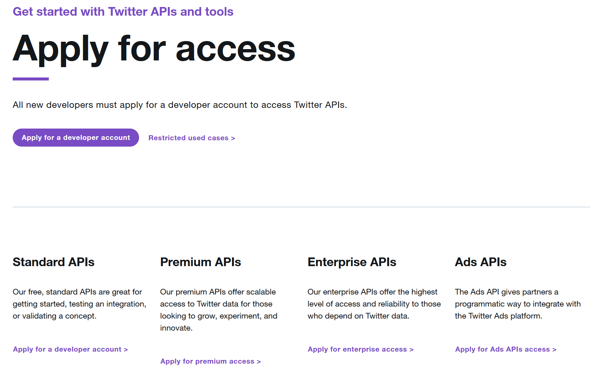
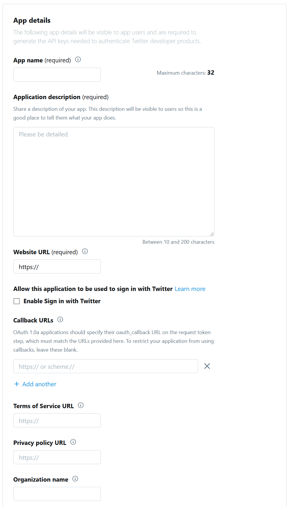
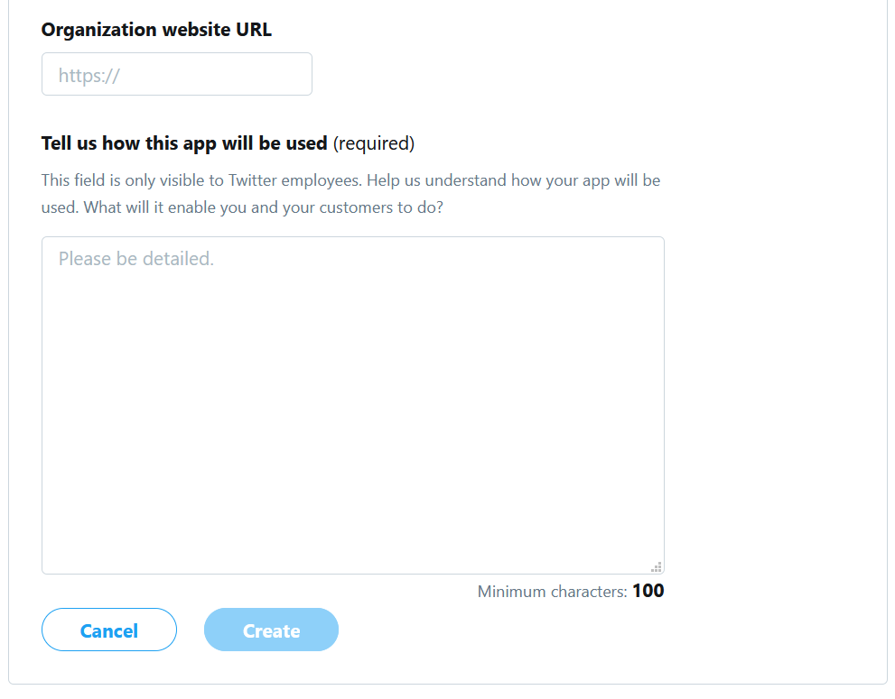
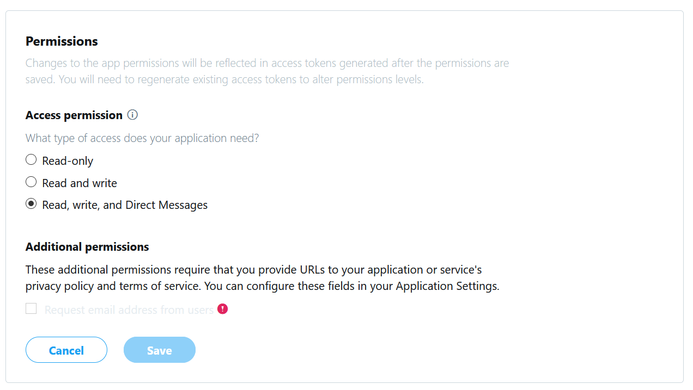
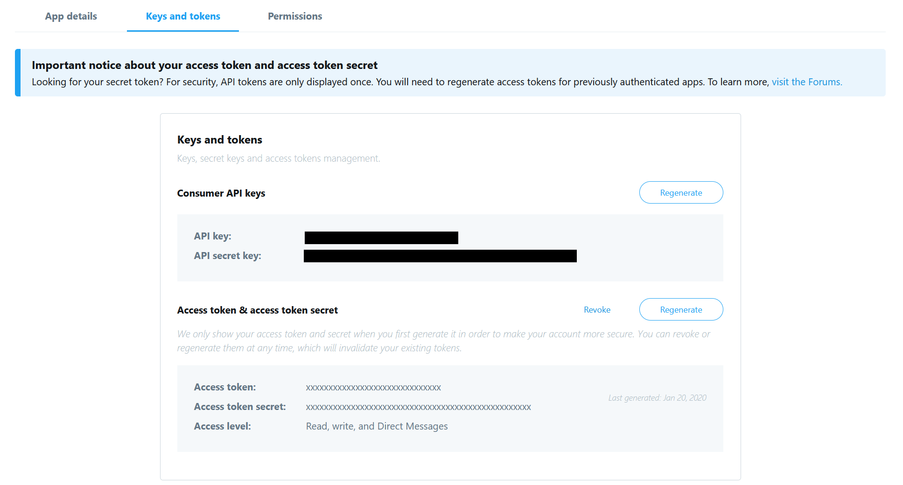
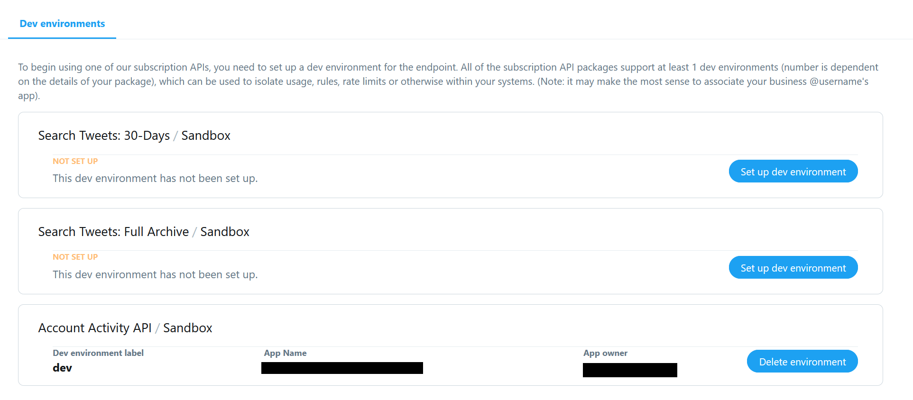

# Configure Botkit and Twitter

Twitter is a constantly evolving platform, nominally you can find everything you [need to create a bot](https://developer.twitter.com/en/docs/basics/getting-started) on their platform page, but that information is subject to change.

### 1. [Install Botkit](https://botkit.ai/getstarted.html)

Once installed, you will need to do steps 2-7 if you have not already. It helps to have your development environment and the Twitter for Developers page open at the same time.

### 2. Apply for a Developer Account

Visit [Twitter Developer Access Page](https://developer.twitter.com/en/apply-for-access) and apply for a developer account to access the Twitter APIs.

### 3. Create a Twitter App

Visit [Twitter Developer Portal](https://developer.twitter.com/en/apps) and create a new app.

* fill out form and specify url where your webhook endpoint will be available

### 4. Allow Access to the Direct Messages
Navigate to your app and then Permission and edit the permission to allow `read, write and Direct Message`.

### 5. Get Access Tokens for your App
Navigate to your app and then Keys and Tokens to generate comsumer api keys as well as an access token and secret.

Copy this all keys and tokens, you'll need it when running your bot.

### 6. Set up a dev Environment
Navigate to the dev environments page of your Twitter developer account to set up an account activity dev environment.

Copy the label of the environment, you'll need it when running your bot.

### 7. Run your Application

Run your application with your environment variables set:

* `TWITTER_CONSUMER_KEY` - Your Consumer Key (**required**)
* `TWITTER_CONSUMER_SECRET` - Your Consumer Secret (**required**)
* `TWITTER_TOKEN` - Your Access Token (**required**)
* `TWITTER_TOKEN_SECRET` - Your Access Token Secret (**required**)
* `TWITTER_WEBHOOK_ENV` - Your Development Environment Label (**required**)

If your application has been configured correctly, you will be able to subscribe to the account activity of your bot account and send tweets and messages in his name. Congratulations!

### Additional resources
*  [Botkit Twitter readme](../platforms/twitter.md)
*  [Messenger Platform Documentation](https://developers.facebook.com/products/messenger/)

