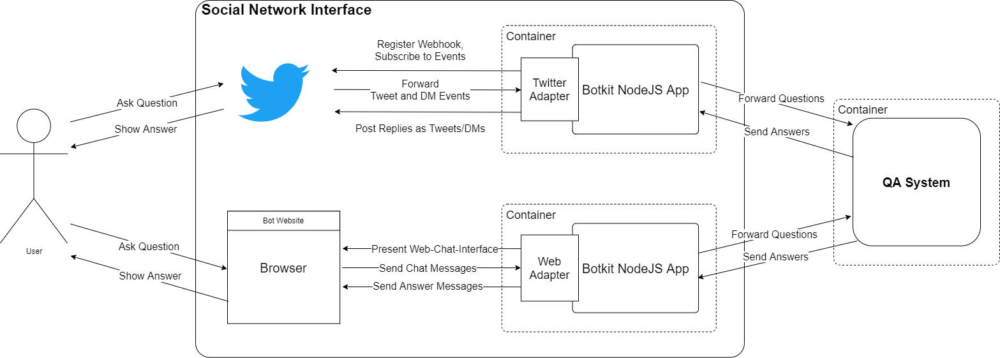
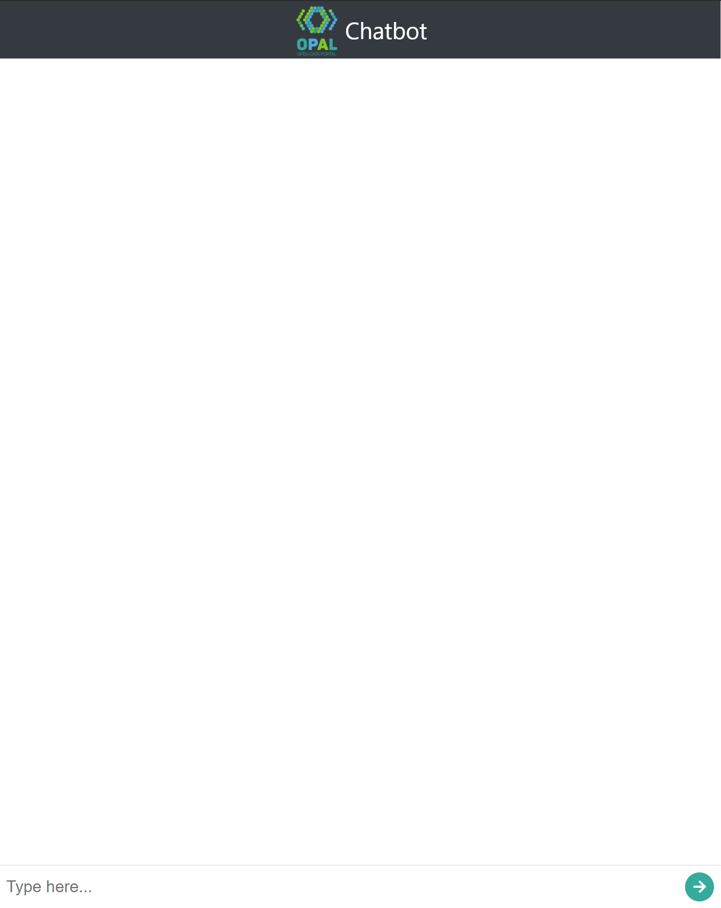

# Web Bot

This project implements a chatbot connected to a webapp chatinterface that provides a conversational interface for the DCAT QA system. It was developed as part of the bachelorthesis "A Question Answering (QA) System for the Data Catalog Vocabulary (DCAT)".
 
In particular the project consists of nodejs app that:
- serves a web chat interface
- consumes all messages users send through the chat inteface
- uses botkit to manage conversations and implement all dialogs
- passes all questions to the specified QA system endpoint
- presents the results from the QA system to the user
  
The web bot is a part of the social network interface for the DCAT QA system. The following shows an overview of all components of the interface and how they communicate:



More info on the implementation details can be found in the [thesis](https://git.cs.uni-paderborn.de/martenls/bachelor-thesis/-/blob/dev/thesis/thesis.pdf).

## Demo of the Web Bot



## Live Demo

A live demo can be found [here](https://openbot.cs.upb.de/sninterface/web/en/).

## Build Docker

Build yourself with (run in `web-bot` folder)
```
docker build -t sninterface-web .
```
 or pull from gitlab container registry with 
```
docker login hub.cs.upb.de
docker pull hub.cs.upb.de/martenls/bachelor-thesis-code/sninterface-web
```

## Run

### Environment Variables

| variable         | default | example                          | description                                                                                                             |
| ---------------- | ------- | -------------------------------- | ----------------------------------------------------------------------------------------------------------------------- |
| `PORT`           | 3000    | 3030                             | defines the port where the web interface should be delivered.                                                           |
| `BOT_LANG`       | en      | de                               | defines in which language the bot responds but not the language in which questions can be asked.                        |
| `QA_URL`         |         | https://openbot.cs.upb.de/qa     | the URL of the qa system the bot sends the questions to                                                                 |
| `FUSEKI_URL`     |         | https://openbot.cs.upb.de/fuseki | sets the URL of the Apache Jena Fuseki instance, that is used to provide links for receiving all results for a question |
| `FUSEKI_DATASET` |         | opal2020-07                      | sets the name of the dataset used to build the links                                                                    |

A template can be found in the `.env-templates` folder.

### Locally

Prerequisites:
  - node
  - npm

Run in `web-bot` directory:

install dependencies

    npm install

run app

    node bot.js

### Docker

pass env variables via file:

```
docker run --name sninterface-web -p '3030:3030' --env_file .env sninterface-web
```

or use provided `docker-compose.yml`